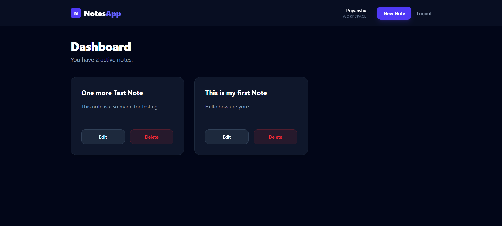
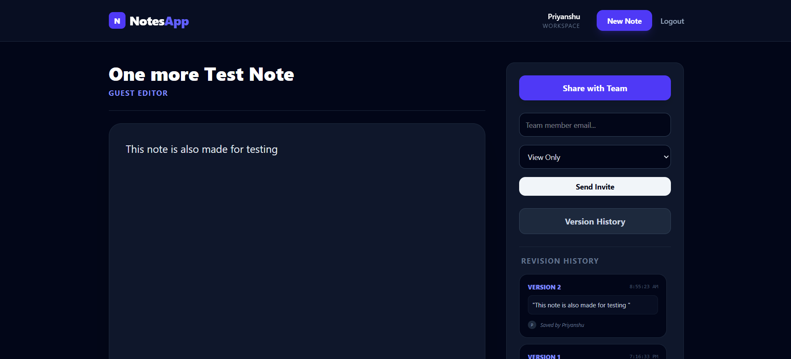
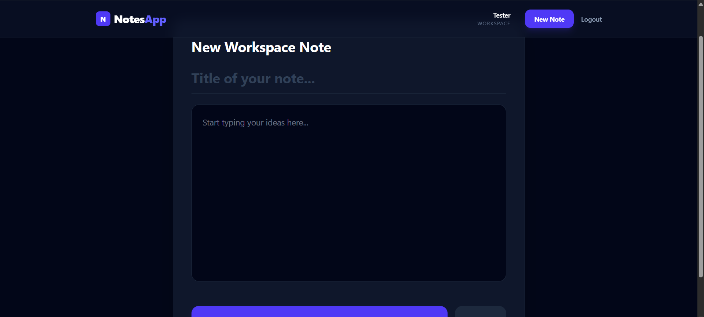
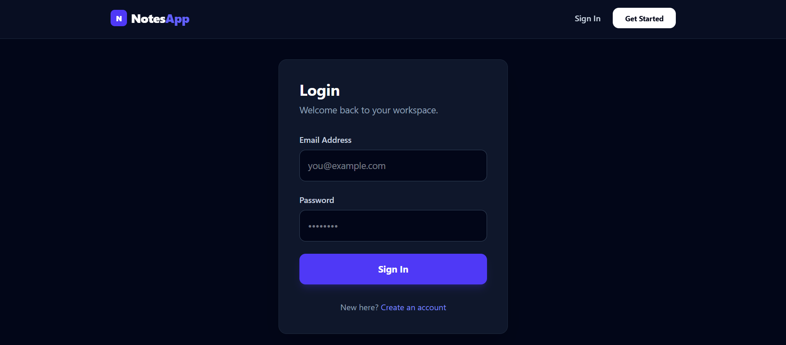

# 📝 CollabNotes - Real-time Collaborative Workspace

**CollabNotes** is a "Notion-lite" application designed for seamless team collaboration. Built as a technical assessment, it features real-time document synchronization, granular permission handling, and detailed version history tracking.

---

## 🖥️ Screenshots

### 🏠 Candidate Home Page


### 📊 Admin Dashboard


### 🔑 Authentication (Review and change status)


### 🔑 Authentication (Login & Register)


---

## 🚀 Core Features

- **Real-time Collaborative Editing:** Multiple users can edit the same note simultaneously with sub-second synchronization powered by WebSockets.
- **Permission-Based Access:** A robust invitation system where the Note Owner must grant "Read" or "Edit" permissions before collaborators can contribute.
- **Presence Indicators:** Visual "User is typing..." feedback to prevent overlapping edits and enhance the collaborative feel.
- **Version History Tracking:** Comprehensive logs for every note, tracking:
  - Version Numbers
  - Timestamps
  - Editor Details (Who made the change)
  - Content Snapshots
- **Optimistic UI:** Fast, responsive interface updates for deletions and edits to ensure a smooth user experience.
- **Secure Authentication:** JWT-based login and registration to protect private notes.

---

## 🖥️ Tech Stack

### Frontend
- **React.js** (Vite)
- **Tailwind CSS** (Slate/Indigo Premium Dark Theme)
- **Socket.io-client** (Real-time Communication)
- **Axios** (API Management)
- **React Hot Toast** (Interactive Notifications)

### Backend
- **Node.js** & **Express.js**
- **MongoDB** & **Mongoose** (Data Modeling)
- **Socket.io** (WebSocket Server)
- **JWT** (Secure Authentication)

---

## 🌐 Live Demo

> 🚀 [SyncNote Live]()  
> backend (https://real-time-collaborative-notes-3p97.onrender.com)
> *(Hosted using Render / Vercel — may take a few seconds to wake up if idle)*

### 🔑 Test Credentials
If you'd like to skip registration, use these accounts:
- **Email:** `test@email.com` | **Password:** `123456`
- **Email:** `priyanshu@email.com` | **Password:** `123456`

---

## 📦 Installation & Setup

### 1. Clone the repository
```bash
git clone [https://github.com/Priyanshu-010/real-time-collaborative-notes](https://github.com/Priyanshu-010/real-time-collaborative-notes)
cd real-time-collaborative-notes

2. Backend Setup

cd backend
npm install

Create a .env file in the backend folder:
PORT=3000
MONGO_URI=your_mongodb_atlas_connection_string
JWT_SECRET=your_secret_key

Start the server:
npm run dev


3. Frontend Setup

cd ../frontend
npm install

Start the application:

npm run dev

---

🛠️ Data Modeling (Assignment Highlights)

Notes: Stores metadata, content, and an array of collaborators with specific permission levels.

Versions: A separate collection that captures snapshots of note content triggered by significant edit events.

Permissions: Middleware-level checks ensure only authorized users can emit note-update socket events.

---

## 👤 About the Developer

**Priyanshu Rai** 📧 [priyanshurai2772@gmail.com](mailto:priyanshurai2772@gmail.com)  
🔗 [LinkedIn](https://www.linkedin.com/in/priyanshuraidev/)  
💻 [GitHub](https://github.com/Priyanshu-010)

---